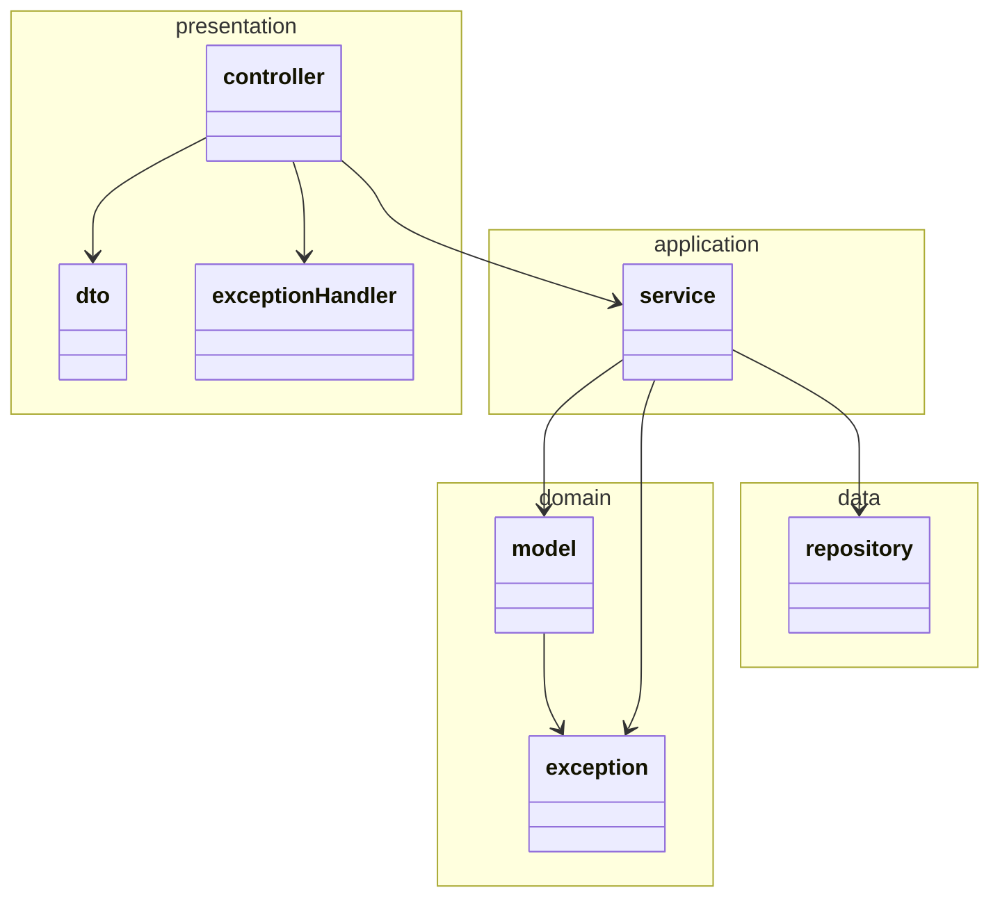
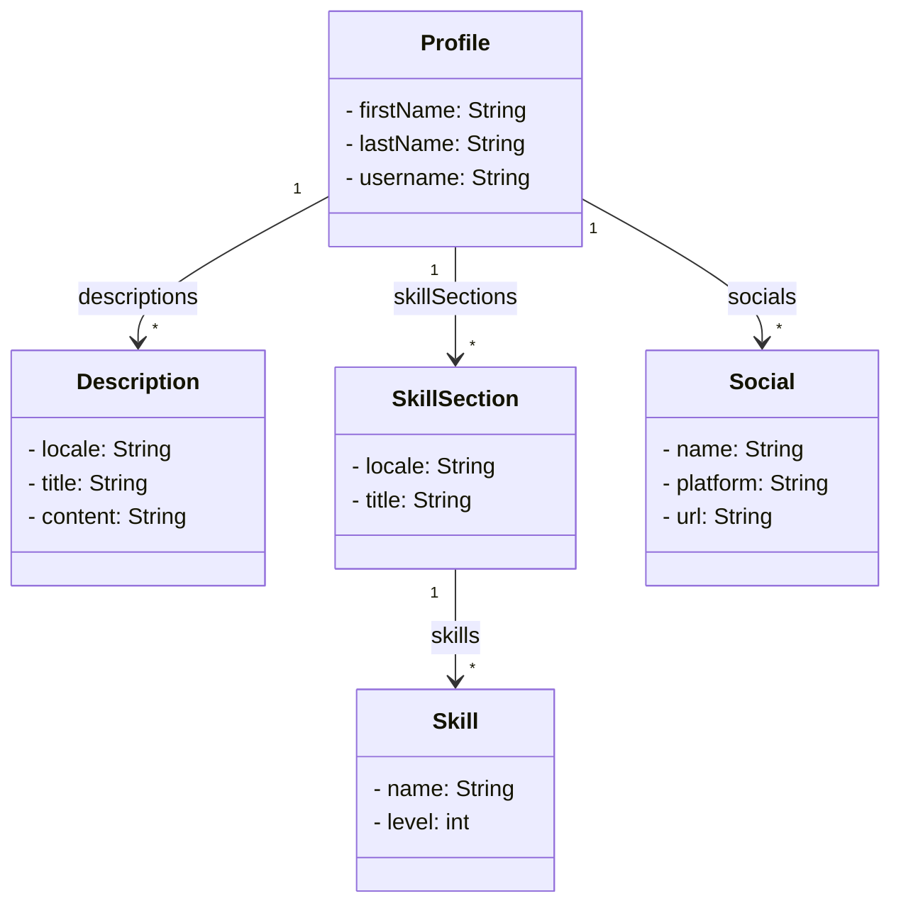

# WiemanApi

A simple API used to manage information about me in a centralized placed.

## Getting Started

This project is made with Spring Boot please refer to the [Spring Boot Documentation](https://docs.spring.io/spring-boot/docs/current/reference/htmlsingle/) for more information.

## Design

### Layer architecture

### Domain

